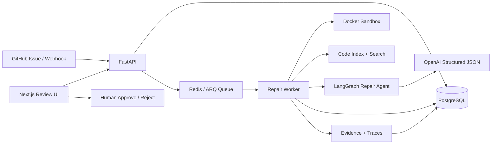

# RepoMedic Architecture

## Request flow

1. **Ingest** — API accepts a GitHub issue URL, manual payload, or webhook and creates a `RepairTask` (`queued`).
2. **Queue** — Job is enqueued on Redis via ARQ.
3. **Clone** — Worker clones the repo (or copies the synthetic fixture) into `workspaces/<task_id>/repo`.
4. **Diagnose** — Acceptance criteria → AST/symbol index → relevant search → sandboxed reproduction.
5. **Repair** — Patch plan → bounded file edits → validation (path safety, file count, diff size).
6. **Verify** — Targeted tests + lint/type checks inside the sandbox; retry up to `MAX_PATCH_ATTEMPTS`.
7. **Review** — Diff, evidence, traces, and PR summary are stored for the web UI. No auto-merge.

## Safety boundaries

| Control | Behavior |
|--------|----------|
| Sandbox | Memory/CPU limits, optional `--network=none`, command timeout |
| Patch validator | Blocks `.env`, `.git`, path escapes, oversized diffs |
| Approval gate | Status stops at `awaiting_review` until a human decides |
| Secrets | Never committed; `.env.example` only |

## Persistence

PostgreSQL holds tasks, issue snapshots, checklist items, code-index stats, patch plans/attempts, evidence, agent traces, PR summaries, and review decisions.